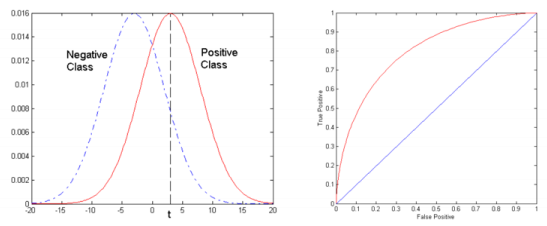
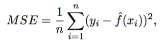
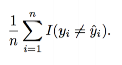

# Machine learning concepts

## Index

1. [Motivation](#Motivation)
    1. Prediction
    1. Inference
1. [Performance Analysis](#Performance%20Analysis)
    1. Confusion Matrix
    1. Accuracy
    1. f1 score
        1. Precision
        1. Recall
        1. Harmonic Mean of Precision and Recall
    1. ROC Curve - Receiver Operating Characteristics
    1. Bias-Variance Tradeoff
    1. Goodness of Fit = R^2
    1. Mean Squared Error
    1. Error Rate
1. [Tuning](#Tuning)
    1. Cross-validation
        1. Leave-p-out cross-validation
        1. Leave-one-out cross validation
        1. k-fold cross-validation
        1. Holdout method
        1. Repeated random sub-sampling validation  
    1. Hyperparameters
        1. Grid Search
        1. Random Search
        1. Gradient-based optimization
    1. Early Stopping(Regularization)
    1. Overfitting
    1. Underfitting
    1. Bootstrap
    1. Bagging
1. [Types](#Types)
    1. Regression
    1. Classification
    1. Clustering
    1. Density Estimation
    1. Dimensionality Reduction
1. [Kind](#Kind)
    1. Parametic
    1. Non-Parametic
1. [Categories](#Categories)
    1. Supervised
    1. Unsupervised
    1. Reinforcement Learning
1. [Approaches](#Approaches)
1. [Taxonomy](#Taxonomy)
    1. Generative Methods
        1. Mixtures of Gaussians, Mixtures of experts, Hidden Markov Models(HMM)  
        1. Gaussians, Naïve Bayes, Mixtures of multinomials
        1. Sigmoidal belief networks, Bayesian networks, Markov random fields
    1. Discriminative Methods
        1. Logistic regression, SVMs
        1. Traditional neural networks, Nearest neighbor
        1. Conditional Random Fields (CRF)
1. [Selection Criteria](#Selection%20Criteria)
    1. Prediction Accuracy vs Model Interpretability
1. [Libraries](#Libraries)

## Motivation

### Prediction

- 우리가 input의 결과로서 예측된 variable을 주로 관심있어 하지만 input의 각각의 방법이 예측에 영향을 끼치지 않을 때 사용
- 만약 부동산 예제라면, Prediction은 이런 질문을 날릴 것이다:
  - 내 집의 가치가 높이 평가됬나요? 낮게 평가됬나요?
- Non-linear model 좋음 but inference에는 좋지 못함
  - 모델 해석 어려움.

### Inference

- 우리가 각각의 input들이 예측에 영향을 끼치는 것에 대해 관심이 있을 때.
- 부동산 예제에서, 추론은 이런 질문을 날릴 것이다:
  - 내가 바닷가가 보이는 집을 가지려면, 얼마나 들까요?
- Linear model은 추론(inference)에 적합
  - 모델이 Non linear model들보다 이해하기 쉬움

## Performance Analysis

### Confusion Matrix


### Accuracy

- 맞는 예측들의 비율, dataset이 unbalanced되어 있을 때 비뚤어져 있기 때문에 신뢰할 수 있는 게 아님.
- Dataset이 unbalnced 되어 있을 때는 다른 class들에 있는 sample들의 수가 크게 다를 때라는 것과 같다.

### f1 score

#### Precision

> (TP) / (TP + FP)

- 암이 있다고 진단한 사람이 실제로 암이 있을 확률.
- 다른 말로 말하자면, 암이 있다고 진단한 집단 중에서 TP의 비율.
- positive라고 이름 붙인 classifier가 있을 때, **정말로** positive한 fraction은 무엇일까?

#### Recall

> (TP)/ (TP+FN)

- 정말 병이 있기 때문에 병이 있다고 진단한 비율.
- 정말 병이 있는 사람들 중에서의 TP
- confusion matrix의 bottom row
- 정말로 모든 예제들이 positive example일 때 classifier는 어떤 fraction을 고를 것인가?

### Harmonic Mean of Precision and Recall

```(2 - p - r / (p+r))```

### ROC Curve - Receiver Operating Characteristics



- True Positive Rate (Recall / Sensitivity) vs False Positive Rate (1-Specificity)
- 정말 Positive한 비율 (Recall/ Sensitivity) vs 가짜 Positive한 비율 (1 - Specificity)

### Bias-Variance Tradeoff

- Bias
  - bias는 현실 세계의 문제를 어림짐작 -> 그 차이로 발생하는 error량
  - Bias가 높다면, 그리고/또는 만약 알고리즘이 training data를 동등히 나누지 않는다면 많은 feature 더하려고 시도하거나 더 flexible한 모델 사용
- Variance
  - Variance는 다른 training data set을 사용했을 때 우리의 예측이 변화시키는 양이다.
  - 높을 경우, feature를 제거하거나, 더 많은 data를 얻어야한다.

### Goodness of Fit = R^2

```1.0 - sum of squared errors / total sum of squares(y)```

### Mean Squared Error(MSE)

- (관측되지 않은 것들을 추정하는 과정에서의) estimator의 Mean squared error(MSE) 또는 Mean squared deviation (MSD)는 error square의 평균 또는 deviation(분산)들의 평균을 측정하는 것이다.
- 이는 estimator와 측정된 것의 차이에서의 분산들이다.
- 

### Error Rate

- Classification setting에서 estimate model function을 훈련된 observation에 적용시킨다고 가정 했을 때 mistake의 비율
- 

## Tuning

### Cross-validation

- cross-validation의 한 라운드
  - 하나의 subset에 대한 분석을 실행하면서 Data의 샘플을 차집합들로 분리함 (training set)
  - 다른 subset에 대한 분석을 validating (validation set 또는 testing set)
- 이런 variability를 줄이고 싶음
  - cross-validation은 다른 비율을 적용해서 실행된
  - validation 결과는 round마다 평균이 남.
- 종류
    1. Leave-p-out cross validation
    2. Leave-one-out cross validation
    3. k-fold cross-validation
    4. Holdout method
    5. Repeated random sub-sampling validation

### Hyperparameters

#### Grid Search

- Hyperparameter 최적화의 전통적인 방식은 Grid search 또는 파라미터 sweep
  - 이 방식들은 leraning alorithm의 hyperparameter 공간에서 수동으로 전문화된 subset을 통해 exhaustive searching을 한다.
- 어떤 performance metric으로 안내됨.
  - 특히 training set이 cross-validation 혹은 held-out validation set을 평가함으로서 측정됨

#### Random Search

- grid search가 exhaustive하고 매우 비싸질 가능성이 있는 method이기 때문에, 대안이 제시되었다.
- 특히, parameter setting들을 단순하게 sample하는 randomized search는 high-dimensional space에서 고정된 시간동안 exhaustive search 보다 더 효과적이라고 알려졌다.

#### Gradient-based optimization

- 특정한 learning algorithm들에서, hyperparameter들에 대해서 gradient를 계산하는 것이 가능하다.
- 그러므로 gradient descent를 이용해 hyperparameter들을 최적화한다.
- 신경망에서 처음 쓰였다.
- 그 때 이후로, 이러한 방법들은 support vector machine이나 logistic regression같은 다른 모델로 확장되었다.

### Early Stopping(Regularization)

- Early stopping rule은 learner가 over-fit을 시작하기 전에 얼마나 많은 iteration이 돌아야 하는 지에 대해 가이드라인을 제공한다.
- 그 다음 그 지점에서 algorithm을 멈춘다.

### Overfitting

- 주어진 method가 samll training MSE (또는 cost)를 산출하지만, 큰 test MSE(혹은 비용)을 산출할 때에는 "overfitting the data"라고 말한다.
- 우리의 통계학적인 학습 방법 -> 너무 패턴을 찾기 어려워서 일어난다.
- 이것은 우리의 함수의 속성 때문이 아니라 random change 때문에 일어나는 것 같다.
- 다른 말로하자면, 이 알고리즘이 training data를 **너무 잘 학습**해서 일어나는 문제
- 모델이 overfit됬을 경우 feature들의 일부분을 지움, 자유로운 정도를 지움, data를 더 추가한다.

### Underfitting

- Overfitting의 반대
- Underfitting: statistical model/machine learning algorithm -> data의 기저에 깔려있는 trend를 잡지 못할 것 같을 때
- data에 충분히 fit하지 못할 때 발생
- 또한 모델이나 알고리즘이 low variance지만 high bias(반대로 대조하)를 보여준다면 underfitting이 일어날 수 있다.
- 과도하게 심플한 모델의 결과일 수도 있다.

### Bootstrap

- 사용 가능한 data의 배치를 가지고 Random Sampling을 적용해 test 적용
- 정확도를 측정할 수 있는 것들을 할당(bias, variance 등등) 후에 sample estimate에 적용

### Bagging

- bootstrapping에 기초한 ensemble learning에 대한 접근
- training set이 주어지면, original dataset에서 replacement로 sampling함으로서 다양한 training set을 생성
- 각각의 bootstrap sample에서, model을 build한다.
- 결과는 model의 ensemble이고, 각각의 model은 동등한 weight를 가진다.
- 전형적으로, 이 과정의 목표는 관심있는 모델의 variance를 줄이는 것.(ex decision trees)

## Types

- Regression : supervised problem, 결과는 discrete하기보단 continuous하다.
- Classification
  - input : 2개 혹은 이상의 클래스로 나뉨
  - learner : 이런 클래스에 대해 보이지 않는 input 값을 할당하는 모델 만들어야 함.
  - supervised learning으로 다뤄짐
- Clustering
  - input의 집합이 group으로 나누어짐
  - group에 대해 미리 알 필요는 없음 (classification은 미리 알아야함)
  - unsupervised learning으로 다뤄짐
- Density Estimation
  - input의 분포도를 어떤 공간에서 찾는 것
- Dimensionality Reduction
  - 낮은 차원 공간으로 매핑시킴으로서 input을 단순화 시키는 것.

## Kind

1. Parametric
    1. 함수의 모양이나 함수의 기능적인 형태에 대한 가정을 한다.
        - 예시: f는 linear 하니까 우리는 linear model을 고르면 되겠다.
    2. 우리의 모델을 fit 또는 train 하는 과정을 선택한다.
        - 이것은 linear function에서 beta parameter를 추정하는 것을 의미한다.
        - 일반적인 방법은 다른 것들 중에서 (ordinary) least square다.
2. Non-Parametric
    1. 우리가 함수의 형태에 대해 가정을 할 수 없을 때 쓴다.
    2. 하지만 이러한 방법들이 f를 추정하는 문제를 작은 parameter의 개수로 바꿔주지는 않기 때문에, f를 위한 정확한 추정을 얻기 위해서 많은 관찰이 필요하다.
        - thin-plate spline model이 대표적이다.

## Categories

1. Supervised

    - 컴퓨터는 "선생님"이 준 예제 input과 그들이 원하는 output이 제시된다.
    - 목표는 input과 output을 연결하는 일반적인 rule을 학습하는 것이다.

2. Unsupervised

    - 어떠한 label도 learning algorithm에게 주어지지 않는다.
    - 그 자신이 input 안에서 구조를 찾도록 내버려둔다.
    - Unsupervised learning은 그 자체로 목표가 되거나. (data의 숨겨진 pattern을 찾을 때) 또는 목적으로 향하는 수단 (feature learning)이 된다.

3. Reinforcement Learning

    - 컴퓨터 프로그램은 특정한 목표를 반드시 수행하는 다이나믹한 환경(예를 들어 차를 가지고 운전을 한다든지, 적과 대응하는 게임을 한다던지)과 상호작용을 한다.
    - 이 프로그램은 이것이 문제 상황으로 들어갔을 때 보상과 체벌의 의미를 가진 feedback이 주어진다.

## Approaches

1. Association rule learning
1. Artificial neural networks
1. Deep learning
1. Inductive logic programming
1. Support vector machines
1. Clustering
1. Bayesian networks
1. Reinforcement learning
1. Representation learning
1. Similarity and metric learning
1. Sparse dictionary learning
1. Genetic algorithms
1. Rule-based machine learning
1. Learning classifier systems

## Taxonomy

> 분류

1. Generative Methods
    - class-conditional pdfs(조건부 확률)과 prior probability(이전의 확률)의 모델.
      - class-conditional probability density function
        - 측정의 variability는 random variable x로 표현될 수 있다.
        - 그리고 probability density function(pdf)는 class w에 의존한다.
        - 이 때의 pdf는 p(x|w)로 나타낸다.
    - sampling이 synthetic data point를 생성하기 때문에 "Generative"라고 한다.
    - Popular Models
        1. Mixtures of Gaussians, Mixtures of experts, Hidden Markov Models(HMM)
        2. Gaussians Naive Bayes, Mixtures of multinomials
        3. Sigmoidal belief networks, Bayesian networks, Markov random fields
1. Discriminative Methods
    - 다음에 올 확률을 직접적으로 측정
    - probability distribution에 입각하여 모델을 만드려는 시도가 없다.
    - 계산에 필요한 자원을 주어진 task-better performance에 집중한다.
    - Popular Models
        1. Logistic regression, SVMs
        2. Traditional neural networks, Nearest neighbor
        3. Conditional Random Fields (CRF)

## Selection Criteria

- Prediction Accuracy vs Model Interpretability
  - 본질적인 trade-off가 존재
  - 모델이 f가 선택되는 방식보다 더 flexible 해질 수록, 모델은 더 모호해지고 interpret하기 어려워진다.
  - 하지만 Flexible model은 추론에 좋고, Inflexible한 방법은 예측을 할 때 좋다.

## Libraries

- Python
    1. **Numpy**
        - 이런 array들을 다룰 수 있는 높은 level의 수학적인 함수를 포함하여 높은, 다중 차원의 array와 metrices를 지원.
    2. **Pandas**
        - numerical table들과 time series를 다루기 위해서 data structure와 operation을 제공.
    3. **Scikit-Learn**(사이킷런)
        - 다양한 classification, regression, clustering 알고리즘을 제공.
          - support vector machine, random forests, gradient booting, k-means, DBSCAN을 포함한다.
        - Python numerical과 과학적인 libraries인 NumPy, SciPy와 상호작동(interoperate)을 하게 끔 만들어져 있음
    4. **Tensorflow**
    5. **MXNet**
        - 이것은 train할 때 사용되곤 하는 현대적인 오픈소스 딥러닝 프레임워크이다. 그리고 DNN을 배치한다.
        - MXNet library는 portable(손에 넣고 다닐 수 있을 정도로 작음) 그리고 multiple GPU와 multiple Machine으로 확장할 수 있다.
        - MXNet은 AWS와 Azure 같은 major Public Cloud를 공급하는 사람들에 의해 지원받는다.
        - Amazon도 AWS에서 MXNet을 아마존의 Deep Learning Framework로 선택했다.
    6. **Keras**
        - Python으로 쓰여진 open source neural network library이다.
        - MXNet, Deeplearning4j, Tensorflow, CNTK 또는 Theano 위에서 돌릴 수 있다.
        - DNN으로 빠른 실험을 할 수 있도록 고안됬다.
        - 작고, modular(모듈을 만들 수 있고), 확장할 수 있다는 점에 초점을 맞추었다.
    7. **Torch**
      - open source machine learning library이다.
      - 과학적으로 계산하는 framework
      - Lua 프로그래밍 언어로 짜여진 script language이다.
      - deep machine learning에 대해 넓은 범위의 알고리즘 제공
      - LuaJIT라고 불리는 스크립트 언어를 사용
      - C 실행을 기본으로 한다.
    8. **Microsoft Cognitive Toolkit**
      - 이전에 CNTK라고 알려졌다.
      - 때때로 Microsoft Cognitive Toolkit으로서 스타일된다.
      - 이는 Microsoft Research에 의해서 개발된 Deep Learning Framework다.
      - Microsoft Cognitive Toolkit은 NN을 directed graph를 통한 computational step의 연속된 나열로서 묘사한다.
