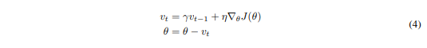

# An overview of gradient descent optimization algorithms

## 정보

- 원래 블로그 출처였다. [blog post](http://sebastianruder.com/optimizing-gradient-descent/index.html)
- 현재에도 블로그엔 업데이트가 지속중이다.
- 논문 [출처](https://arxiv.org/pdf/1609.04747.pdf)
- Optimization : object function을 optimize하는 것.

## Index

- [Abstract](##Abstract)
- [Introduction](##Introduction)
- [Gradient descent variants](##Gradient%20descent%20variants)
  - [Batch gradient descent](###1.%20Batch%20gradient%20descent)
  - [Stochastic gradient descent](###2.%20Stochastic%20gradient%20descent)
  - [Mini-batch gradient descent](###3.%20Mini-batch%20gradient%20descent)
- [Challenges](##Challenges)
- [Gradient descent optimization algorithms](##Gradient%20descent%20optimization%20algorithms)
  - [Momentum](###Momentum)
  - [Nesterov accelerated gradient](Nesterov%20accelerated%20gradient)
  - [Adagrad](###Adagrad)
  - Adadelta
  - RMSprop
  - Adam
  - AdaMax
  - Nadam
  - AMSGrad
  - Other recent optimizers
  - Visualization of algorithms
  - Which optimizer to use?
- Parallelizing and distributing SGD
  - Hogwild!
  - Downpour SGD
  - Delay-tolerant Algorithms for SGD
  - TensorFlow
  - Elastic Averaging SGD
- Additional strategies for optimizing SGD
  - Shuffling and Curriculum Learning
  - Batch normalization
  - Early Stopping
  - Gradient noise
- Conclusion
- References

## Abstract

- Gradient descent optimization algorithm은 매우 유명하지만, 그들의 강점과 약점을 실제적으로 설명하기 어렵기 때문에 black-box optimizer로 종종 사용된다.
- 이 article은 그들이 사용할 수 있도록 다른 알고리즘의 작동에 관련한 본질을 설명한다.
- 이 overview에서 보게 될 것
  - gradient descent의 다양한 variant들을 보게 될 것이다.
  - challenge들을 정리할 것이다.
  - 가장 일반적인 최적화 알고리즘을 설명할 것이다.
  - parallel and distributed setting에서의 architecture을 review할 것이다.
  - gradient descent를 최적화하는 데에 있어 추가적인 전략을 조사할 것이다.

## Introduction

- Section2 : gradient descent의 다양한 변형
- Section3 : 훈련을 하는 동안 생기는 문제점들을 간략하게 요약
- Section4 : 이러한 문제점들을 해결하기 위한 동기를 보여주면서, 가장 일반적인 최적화 알고리즘에 대한 소개
- Section5 : parallel 하고 distributed setting에서 gradient descent를 optimize하기 위해 algorithm과 architectur를 짧게 볼 것이다.
- Section6 : gradient descent를 최적화하는 것을 도와주는 추가적인 전략에 대해 고려해볼 것이다.

## Gradient descent variants

- gradient descent의 3가지 변형이 있다.
- accuracy of the parameter와 update를 수행하기 위해 걸리는 시간 사이엔 항상 trade-off가 있다.

### 1. Batch gradient descent

- Vanilla gradient descent = batch gradient descent라고 불린다.
- cost function의 gradient를 계산한다.
- 이는 다음과 같이 나타낼 수 있다.
- 
- 매우 느리고 메모리에 맞지 않는 dataset을 다루기 어려워한다.
- online에서(새로운 example로) model을 업데이트하는 것을 허용하지 않는다.
- 순서
  - loss function, data, parameter로 gradient를 구한다.
  - parameter = parameter - learning_rate * gradient
- 왠만한 딥러닝 라이브러리에는 그라이언트를 계산하기 편하도록 자동으로 미분해주는 기능이 있다.
- gradient를 직접 얻을 경우, gradient check를 하는 건 좋은 생각이다.
- [gradient check](https://cs231n.github.io/neural-networks-3/)
- parameter를 얼마나 우리가 업데이트를 크게 할지를 결정하는 learning rate를 가지고 gradient 방향으로 업데이트 한다.
- Batch gradient descent는 convex error surface를 위해 global minimum으로 수렴할 것을, non-convex surface일 때 local minimum으로 수렴할 것을 보장한다.
- Batch gradient descent는 큰 데이터 셋에서 중복 계산(redundant computation)을 한다.
  - 각각의 parameter가 update되기 전에 유사한 예제로 gradient를 재계산한다.

```python
for i in range ( nb_epochs ):
    params_grad = evaluate_gradient ( loss_function , data , params )
    params = params - learning_rate * params_grad
```

### 2. Stochastic gradient descent

- 각각의 training example마다 parameter를 update 하는 것.
- 
- SGD는 한 타임에 하나만 update함으로서 중복 계산을 버린다.
- 훨씬 더 빠르고, online에서 학습시킬 수 있다.
- objective function이 무겁게 변동하게 만드는 높은 variance에서 빈번하게 update를 수행한다.
- 
- SGD의 fluctuation은 가능한 새롭고, 가능한 더 local minimum으로 jump할 수 있도록 한다.
  - 이것은 SGD가 overshooting을 계속 한다면 궁극적으로 추출된 minimum으로 수렴하는 것과 충돌이 난다.
- 우리가 learning rate를 천천히 줄일 때 SGD는 batch gradient descent와 동일하게 수렴하는 행동을 보여준다.
  - 거의 non-convex에서는 local minimum으로, convex에서는 global minimum으로 각각 수렴한다.

```python
for i in range ( nb_epochs ):
    np.random.shuffle ( data )
    for example in data :
        params_grad = evaluate_gradient ( loss_function , example , params )
        params = params - learning_rate * params_grad
```

- 반드시 data를 항상 shuffle한다는 것을 기억하라.

### 3. Mini-batch gradient descent

- n 개의 training example의 모든 mini-batch 단위로 update를 수행함.
- parameter update의 variance를 줄임.
  - 이는 수렴하는 값을 더 안정적으로 이끔
- 높게 최적화된 matrix optimization의 사용을 최신의 딥러닝 라이브러리에 일반적으로 만듬.
  - 이는 mini-batch의 gradient를 효율적으로 계산할 수 있게 해줌
- 일반적인 mini-batch size는 50 - 256이지만, 적용에 따라 달라질 수 있다.
- Mini-batch algorithm은 신경망을 훈련할 때 전형적인 선택의 알고리즘이다.
- SGD라는 용어도 mini-batch들이 사용됬을 때 적용되었다.
- batch size = 50 일 때

```python
for i in range ( nb_epochs ):
    np . random . shuffle ( data )
    for batch in get_batches ( data , batch_size =50):
        params_grad = evaluate_gradient ( loss_function , batch , params )
        params = params - learning_rate * params_grad
```

## Challenges

- 일반적인 mini-batch gradient descent가 좋은 수렴을 보장하지는 않는다.
- 문제점
  - 적절한 learning rate를 선택하는 것이 매우 어렵다.
    - learning rate가 작을 경우 : 느린 수렴
    - learning rate가 클 경우 : 수렴을 방해
      - loss function이 minimum 주위에서 놀거나, 심지어 발산하게끔 만듬
  - learning rate의 계획은 annealing에 의해(즉, 미리 정의된 스케쥴 혹은 threshold 밑으로 epoch가 떨어지는 사이에서 나타나는 목표의 변화와 관련해서 learning rate를 지울 때) 훈련 하는 동안 learning rate를 adjust 하려고 노력한다.
    - 하지만, 이러한 schedule이나 threshold가 사전에 미리 정의되어 있어야 한다.
    - 그러므로 이러한 schedule이나 threshold는 dataset의 특징들에게 맞춰 조정할 수 없다.
  - 모든 파라미터 업데이트에 같은 learning rate가 적용된다.
    - 우리의 데이터가 듬성듬성 있거나, 우리의 특징이 매우 다른 빈도를 가진다면, 우리는 같은 범위에서 모든 것을 업데이트 하지 않기를 원할 것이다.
    - 하지만 거의 일어나지 않는 특징에 대해서도 더 큰 update를 수행한다.
  - 신경망에서 일반적으로 일어나는 non-convex error function의 최적화 문제는 많은 최적이 아닌 local minima에 갇히는 것을 피하는 것이다.
    - Dauphin et al.[5]는 이 문제는 local minima가 아닌 saddle point에서 일어난다고 주장했다.
      - saddle point 중에서도 한 쪽은 내려가고, 한 쪽은 올라가는 지점에서 일어난다고 주장했다.
    - 이러한 saddle point는 gradient가 모든 차원에서 0로 갈 때 같은 error의 안정기에 의해 둘러쌓여있고, 이것은 SGD가 도망치는 것을 악의적으로 막는다.

## Gradient descent optimization algorithms

- 문제점들을 해결하기 위한 방법들을 다룬다.
- 이 글에선 실전에서 높은 차원의 data set에 대해 쓸 수 없는 방법들은 제외한다. (예를 들어, Newton's method)

### Momentum

- SGD는 좁은 골짜기를 항해할 때 문제를 겪는다.
  - 좁은 골짜기 : 다른 차원들 보다 1차원일 때 표면이 훨씬 더 가파르게 굽어있는 곳
- 이런 상황에서, SGD는 local optimum으로 향하는 바닥을 따라서 hesitant progress를 만드는 동안 좁은 골짜기의 경사로를 거쳐 진동한다.
- 
- Momentum이란
  - 관련된 방향으로 (relevant direction) SGD를 가속하는 것을 도와주는 방법
  - Figure 2b에서도 볼 수 있듯이, 진동을 방해한다.
  - 과거 time step에서 현재 update vector에 update vector의 fraction을 추가하면 된다.
  - 
  - r은 보통 0.9로 세팅 되거나, 그와 유사한 값으로 설정된다.
- 예시
  - Momentum을 사용할 때, 언덕에 공을 굴리는 것과 비슷하다.
  - 그 공은 downhill에서 굴러갈 때 momentum을 가속한다. 이러한 방식으로 점점 더 빨라진다. (이 공이 공의 정지 속도에 도달할 때까지, 만약 공기 저항이 있다면. 즉 r < 1)
  - 여기서 쓰이는 Momentum도 이와 같다.
  - gradient가 같은 방향을 가리키고 있으면 momentum은 증가하고, 다른 방향을 가리키고 있으면 momentum은 감소한다.
  - 결론적으로 진동은 줄고, 더 빠른 수렴을 할 수 있다.
  
### Nesterov accelerated gradient

- 하지만 공이 언덕을 내려올 때, blind한 채로 경사로를 내려오는 것은, 매우 만족스럽지 않다.
- 공이 만약에 공이 어디로 갈 지를 알고 있다면 어떨까? 그래서 경사로가 다시 올라가기 전에 천천히 속도를 줄인다면?
- NAG(Nesterov accelerated gradient)는 momentum term에게 이런 예측(prescience)을 준다.
- 세타 변수를 움직이기 위해서 우리는 rv(t-1)라는 momentum term을 사용할 것이다.
- 세타 - rv(t-1)을 계산하는 것은 parameter의 다음 포지션에 대한 근사치를 우리에게 준다.(전체적인 update를 위해서 gradient는 사라진다.)
  - 이 근사치는 우리의 parameter가 어디로 갈 지에 대한 대략적인 생각이다.
- 우리는 우리의 현재 parameter 세타가 아니라, 우리의 미래의 parameter를 통해서 gradient를 계산함으로서 효과적으로 더 멀리 볼 수 있다.
- 
- 
  - r = 0.9
  - 처음에, momentum은 현재 gradient를 계산한다. (작은 파란색 벡터)
  - 그 다음, 업데이트 된 모와진(accumulated) gradient의 방향으로 크게 도약한다. (큰 파란색 벡터)
  - 그 동안, NAG는 처음에 과거의 모와진 gradient로 크게 점프한다.(갈색 벡터) 그리고 gradient를 평가한다.
  - 그리고 correction을 한다. (초록색 벡터)
- 이런 예상 업데이트는 너무 빠르게 진행하는 것을 막고, SGD의 스피드를 순서대로 높인다.
- 또한 이런 업데이트는 증가된 responsiveness를 초래하며, 이는 task의 수적인 면에서 RNN의 성능을 증가시킨다.
- 우리는 우리의 중요도에 따라서 각각의 파라미터가 더 크거나 더 작게 업데이트를 수행할 수 있도록 우리의 업데이트를 진행시킨다.
- keras SGD code

```python
v = self.momentum * m - lr * g 
self.updates.append(K.update(m, v))

if self.nesterov:
    new_p = p + self.momentum * v - lr * g
else:
    new_p = p + v
```

### Adagrad

- 빈번하지 않은 파라미터엔 큰 update를, 빈번한 파라미터엔 작은 update를 한 것.
- 듬성듬성한 데이터를 다룰 때 매우 적합하다.
- Dean et al.은 구글에서 Adagrad가 SGD의 robustness를 크게 향상시켰고, large scale 신경망을 가지고 YOUTUBE에서 고양이를 인지하도록 하는데 이것을 썼다고 밝혔다.
- 더욱이, Pennington et al.은 빈번하지 않은 단어들이 더 많은 update를 필요로 하기 때문에 GloVE word embedding에 Adagrad를 썼다고 밝혔다.
- 모든 파라미터 (세타)가 같은 learning rate n을 썼기 때문에 과거엔 모든 파라미터를 업데이트 했다.
- Adagrad는 모든 파라미터에 모든 time step t에서 다른 learning rate를 쓰기 때문에, 우리는 처음에 Adagrad의 파라미터 당 업데이트를 했고, 그것은 그 후에 vectorize 했다.
- g(t,i) : 목적 함수의 gradient, 세타(t,i): time step t에 대한 파라미터
- 
- SGD update
- 
