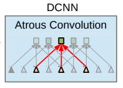

# DeepLab: Semantic Image Segmentation with Deep Convolutional Nets, Atrous Convolution, and Fully Connected CRFs

## Abstract

- Semantic Image segmentation에 관련된 논문
- 값어치가 있다고 실험적으로 증명된 3개의 공헌 : **atrous convolution**, **ASPP**, **DCNN + CRF**

  1. **atrous convolution**
      - upsample 된 filter에 convolution => dense prediction을 하는 데에서 강력한 도구로서 작동.
      - DCNN 안에서 feature response가 계산될 때 resolution(해상도)를 명확하게 제어할 수 있도록 만든다.
      - 파라미터의 개수나 computation 양을 증가시키는 것 없이 더 넓은 context을 합치기 위해서 filter들의 view 영역을 효과적으로 확장할 수 있게 만든다.
  
  2. **ASPP**
      - atrous spatial pyramid pooling (ASPP)
      - 다양한 스케일에서 물체를 엄격하게 분리하기 위해서 씀.
      - 효과적인 fields-of-views와 다양한 sampling rate에 있는 filter를 사용 convolutional feature layer를 살핀다.
      - 따라서 다양한 스케일에서 image context 뿐만 아니라 object도 잡음

  3. **DCNN + CRF method=> object boundary의 localization 향상**
      - 일반적으로 전개되는 max-pooling과 downsampling의 조합은 invariance를 향상, 그러나 localization accuracy에 영향을 끼침
      - 이를 마지막 DCNN layer의 responce를 fully connected Conditional Random Field (CRF)와 결합함으로서 극복
        - 이 결합은 질적, 양적 모든 측면에서 localization performance를 향상
  
- **Index Terms : Convolutional Neural Networks, Semantic Segmentation, Atrous Convolution, Conditional Random Fields.**

## Introduction

- DCNN의 성공 --> local image transformation에서 built-in invariance 때문.
  - 특히 classification에서 중요함. --> local image transformation이 추상적 데이터 표현을 배우도록 허락하기 때문.

- 그렇지만 semantic segmentation같이 dense prediction task(조밀한 예측 작업)에는 방해.
  - 공간 정보의 추상화가 필요 없기 때문.

- 이 논문에선 semantic image segmentation에 있어 DCNN의 3가지 문제점을 고려
  1. 감소된 feature resolution
  2. 다양한 스케일에서 object의 존재성
  3. DCNN invariance 때문에 localization accuracy가 감소

- 3가지 문제점의 극복

  1. 감소된 feature resoltuion => Atrous convolution으로 극복
  - 원인
    - DCNN 안의 연속된 layer에서 실행되는 max-pooling과 downsampling('striding')의 반복적인 결합으로 인해 발생.
    - fully convolutional fashion에서 DCNN이 적용됬을 때 감소된 spatial resolution을 가진 feature map을 만들어 냄.
  - 해결
    - 마지막 부분에 존재하는, 몇 개의 max pooling layer 안의 downsampling operator를 제거, 대신 다음의 convolutional layer안에서 filter를 upsample
      => 더 높은 sampling rate를 가진 feature map을 산출한다.
    - Filter upsampling을 할 때 zero가 아닌 값들로 이루어진 filter tap들 사이에서 hole(trous)을 삽입한다.
      - 이 방법은 undecimated wavelet transform에서 효율적인 계산을 위해 고안된 방법이다.
      - 이를 atrous convolution으로 부르기로 한다.
    - 실제로, atrous convolution을 조합함으로서 full resolution feature map을 회복한다.
      - 이는 feature map을 더 조밀하게 만듬
    - atrous convolution은 기본 image size에서 feature response의 단순한 bilinear interpolation으로 이어진다.
    - dense prediction을 하는 데 있어, deconvolutional layer를 사용하는 것보다 단순하고, 강하다.
      - 큰 필터를 가지고 있는 정규 convolution과 비교하면, atrous convolution은 파라미터들의 개수나 computation의 양이 증가 하는 일 없이 filter의 field of view를 효과적으로 증가시키게끔 한다.
  

  1. 다양한 스케일에서 object의 존재 => Atrous Spatial Pyramid Pooling (ASPP)로 해결
  - 원인
    - 다양한 스케일에서 object가 존재하는 것에 의해 발생
  - 해결
    - 일반적인 방법 : DCNN에서 제시됨.
      - 같은 이미지에서 크기를 조절한 여러가지 이미지를 만듬
      - feature랑 score map을 증가
      - 장점 : 시스템의 성능을 증가
      - 단점 : 비용 (input image의 다양한 버전을 만들고, 모든 DCNN layer의 feature response를 계산해야 함)
    - convolution 전에 계산적으로 효율적인 스키마를 제시
      - spatial pyramid pooling에 영향을 받음.
      - 다른 sampling rate에서 multiple parallel atrous convolutional layer를 사용해서 이런 mapping을 실행
      - 제시된 이런 technique를 atrous spatial pyramid pooling이라고 부른다.

  1. DCNN invariance 때문에 localization accuracy 감소 => CRF로 해결
  - 원인
    - object를 중앙에 놓는 classifier는 spatial transformation에 invariance를 필요로 하게 된다.
    - 이는 본질적으로 DCNN의 spatial accuracy를 제한시킨다.
  - 해결
    - 일반적인 방법:
      - 마지막 segmentation 결과를 계산할 때 다양한 network로부터 "hyper-column" feature를 추출하기 위해서 skip-layer사용
    - 좀 더 효율적인 방법 : CRF를 사용
      - fully connected Conditional Random Field (CRF)를 적용시킴으로서 fine detail을 잡는 model의 능력을 향상시킴
      - 주로 semantic segmentation에서 사용
      - semantic segmentation에서 다양한 방법의 classifier들로 계산된 class score를 pixel들과 edge들, 혹은 superpixel들의 local interaction으로 잡아진 low-level information과 결합
      - 효율적인 계산, fine dege detail을 잡을 능력, long range dependency
      - pixel level classifier를 기반으로 한 성능을 향상

- Fig 1.에서 DeepLab model의 전반적인 모습 확인
[Fig1]
- VGG-16 이나 ResNet-101의 재 목적화 (image classification -> semantic segmentation)
  - fully connected layer를 convolutional layer로 변환 (즉, fully convolutional network)
  - atrous convolutional layer를 통한 feature resolution의 향상
    - 기본이 되는 network의 모든 32 픽셀 대신 모든 8 픽셀에 대한 응답을 계산할 수 있도록 한다.
  - bi-linear interpolation 적용
    - 기본 이미지 해상도에 도달하기 위해서 8배에 의해 score map을 upsample 하기 위함
    - segmentation 결과를 정제하는 fully-connected CRF로 input을 산출
- DeepLab 시스템의 3가지 장점
  1. Speed
      - atrous convolution의 장점으로 인해, DCNN은 NVidia Titan X GPU에서 8FPS로 운영된다.
        - fully-connected CRF를 위한 Mean Field Inference는 CPU에서 0.5초를 필요로 한다.
  2. Accuracy
      - PASCAL VOC 2012 semantic segmentation benchmark, PASCAL-Context, PASCAL-Person-Part, Cityscape에서 경쟁력 있는 점수를 얻음
  3. Simplicity
      - 잘 만들어진 모델 DCNNs과 CRFs의 cascade(계단식)로 구성되어 있다.

## Methods

### Atrous Convolution for Dense Feature Extraction and Field-of-View Enlargement

#### Atrous Convolution

- 32배 다 거치는 것 => feature map의 spatial resolution을 감소시킴
- 부분적인 치료제 : deconvolutional layer
  - 하지만 추가적인 메모리와 시간이 필요
- 얘 대신에 atrous convolution 쓸 것.
  - 이 알고리즘은 어떤 원하는 resolution에서 어떤 layer에서의 응답이라도 계산할 수 있게끔 함
- 일단 한 번 훈련되면 post-hoc에 적용, 그렇지만 겉보기엔 훈련과 통합시킬 수도 있다.
- 1차원 signal
  - output y[i], 1차원 input x[i], K length를 가진 filter w[k]
  - (1) 그림
  - rate parameter r : input signal을 sample한 stride에 상호응답한다.
  - 일반적인 convolution에서는 특별한 case로, r = 1
  - [Fig2]
- [Fig3]에서 단순한 예제로 2차원일 때 알고리즘의 작동을 묘사했다.
  - 일단 이미지가 주어지면, 우리는 처음에 downsampling operation을 한다.
    - resolution을 2배로 바꾸기
  - kernel에서(vertical Gaussian derivative) convolution을 수행하기
  - 원본 이미지 coordinate에 feature map을 수행하면,이미지 위치의 오직 1/4만 응답으로 얻을 수 있다.
  - 대신에, 만약 full resolution image를 '구멍이 있는' filter를 가지고 convolve 하면 모든 이미지 위치에서 응답을 계산
    - 2배수의 original filter를 upsample 하고, filter value들 사이에 있는 zero들을 소개하는 filter이다.
  - 비록, 효과적인 filter size가 증가한다 하더라도, 우리는 오로지 non-zero filter value를 설명해야한다.
    - 따라서, filter parameter의 수와 position당 operation들의 수는 constant하게 남아있다.
  - 결과적인 scheme는 쉽고 명확하게 신경망 feature responce의 spatial resolution을 control 하도록 도와준다.

#### Use for chain of layers

- DCNN에서의 context 안에서, atrous convolution을 layer들의 chain으로 사용할 수 있다.
  - 효과적으로 자율적인, 높은 resolution에서 최종적인 DCNN network responce를 계산하는 걸 허용합니다.
  - VGG-16 또는 ResNet-101 에서 계산된 feature response의 spatial density를 두 배로 하기 위해서, 마지막 pooling 또는 convolutional layer의 stride를 1로 설정합니다.
    - 마지막 pooling 또는 convolutional layer는 resolution을 감소시키기 때문입니다.
    - 이렇게 stride를 1로 설정하면 signal decimation을 피할 수 있습니다.
  - 그리고 모든 부수적인 convolutional layer들을 atrous convolutional layer로 대체합니다.
    - 이 때의 rate = 2
  - 이 방법은 너무 비용이 많이 듭니다.
- 따라서 hybrid 방법을 써야합니다.
  - 계산된 feature map의 density를 4배로 만드는 방법
  - 후에 8배의 추가적인 fast bilinear interpolation을 합니다.
    - class score map이 (log-probability와 상호응답한) 꽤 부드럽기 때문에 씁니다.
    - 이는 Fig 5에서 나와있습니다.
  - deconvolutional approach와 다르게, 제시된 접근은 어떤 extra parameter를 배우는 것을 필요로 하는 것 없이 image classification network를 dense feature extractors로 바꾼다.
    - 실제로 DCNN trainning을 빠르게 이끈다.

#### Enlarge Field of view of filters at any DCNN layer

- 최신 DCNN은 일반적으로 공간적으로 작은 convolution kernel을 허용한다. (일반적으로 3x3)
  - 이는 파라미터의 수와 그 계산을 포함되게 하기 위해서이다.
- rate r을 가지고 있는 atrous convolution은 연속적인 filter value에서 r-1개의 0들을 소개한다.
  - 효과적으로 kxk개의 filter kernel size를 키운다.
  - k = k + (k-1)(r-1)에 적용
  - 파라미터의 수 증가나 계산을 하는 양을 증가시킬 필요 없음.
  - field-of-view를 control하거나 accurate localization(small field of view)와 context assimilation(large field of view)에서 가장 좋은 trade-off를 찾음.
  - VGG-16에서 r = 12를 했더니 성공적으로 perfomance가 증가

#### atrous convolution을 수행하는 2개의 효과적인 방법

1. **implicitly upsample the filters**

- im2col이라는 function을 더해서 수행해봄
  - vectorized patch를 feature map의 다양한 채널에서 추출
  - 기저한 feature map을 드문드문 sample하는 option이다.  

1. **equivalently sparsely sample the input feature maps**

- input feature map을 atrous convolution rate r과 동일한 요소로서 subsample하는 것.
  - r^2로 제거된 resolution map을 생산하기 위해서 이것을 deinterace한다.
  - 각각의 rxr possible shift를 위해 만들어진다.
- 이는 표준 convolution을 이러한 intermediate feature map에 적용시키는 것으로 이어진다.
- 그리고 그들을 original image resolution으로 reinterlace한다.
- atrous convolution을 regular convolution으로 줄임으로서, off-the-shelf optimized convolution routine을 사용하도록 하용

### Multiscale Image Representations using Atrous Spatial Pyramid Pooling

- DCNN은 본질적으로 scale을 보여주는 주목할만한 능력을 보여줘왔다.
  - 다양한 사이즈의 object를 포함하는 dataset에서 단순히 훈련된 것만으로도 주목할만한 능력을 보여줌.
- 여전히 명시적으로 object scale에 대해 설명하는 것은 성공적으로 크고 작은 object들을 다루는 DCNN의 능력을 향상시킴.
- scale variability를 semantic segmentation에서 다루는 것에 대한 두 개의 접근 시도
  1. standard multiscale processing
      - original image의 multiple rescaled version 에서 DCNN score map을 추출.
      - 같은 parameter를 공유하는 parallel DCNN branch들을 사용.
      - 마지막 결과를 생성하기 위해서, parallel DCNN branch들에서 original image resolution으로 feature map을 bilinearly interpolate 함.
      - 그리고 그것들을 다른 scale를 거쳐 가장 큰 response를 각각의 position에서 얻음으로서 합성시킴
      - Multiscale processing은 performance를 향상시킴.
  2. convolutional feature -> resample
      - RCNN 공간 pyramid pooling method의 성공에 자극을 받아 만들어짐.
        - pyramid pooling method 는 자율적인 scale의 영역이 정확하게 효율적으로 classify됨을 보여줌.
          - 하나의 크기에서 추출된 convolutional features를 resample하는 것에 의한다.
      - 다른 sampling rate를 가지고 Multiple parallel atrous convolutional layer들을 사용하는 scheme의 다양성을 수행해옴
      - 각각의 sampling rate에서 추출된 특징들은 분리된 branch들 안에서 훨씬 process가 잘 되어있고 최종 결과물을 생산하기 위해서 잘 융합되어 있다.
      - "atrous spatial pyramid pooling" 접근은 우리의 DeepLab-LargeFOV를 일반화합니다.

### Structured Prediction with Fully-Connected Conditional Random Fields for Accurate Boundary Recovery

- localization accuracy와 classification performance 사이의 trade-off는 DCNN에서 본질적인 것으로 보인다.
  - multiple max-pooling layer들을 가지고 있는 더 깊은 모델이 classification task에서 훨씬 성공적인 것으로 증명되었다.
  - 하지만, 증가된 invariance와 큰 top-level node의 receptive fields는 smooth response만들 산출할 수 있다.
  - Fig 5에서 묘사되었듯이, DCNN score map은 object의 대략적인 위치나 존재를 예측할 수 있다.
  - 하지만 그 경계선을 delineate하지는 못한다.
- 과거의 연구는 이러한 localization challenge를 설명하기 위한 2개의 방법을 쫒았다.
  - object boundary를 더 좋게 추정하기 위해서,

[코드 공유](http://liangchiehchen.com/projects/DeepLab.html)
[Fig1]
[Fig2]
