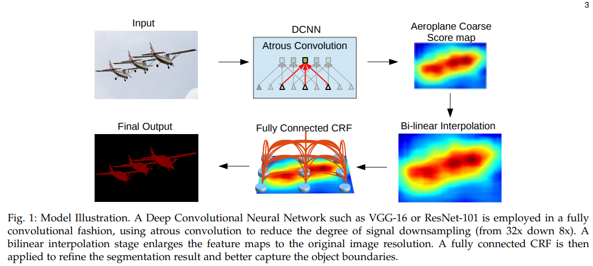
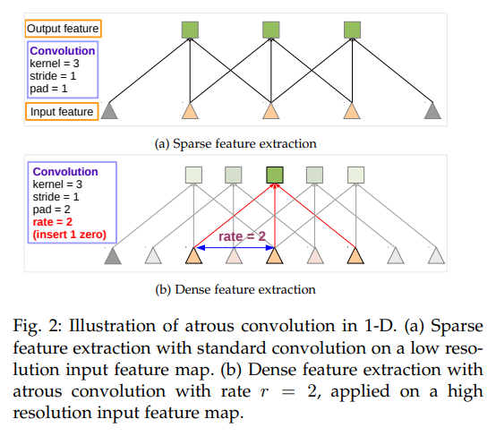
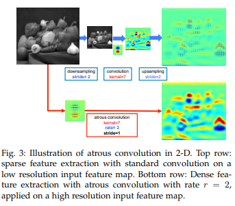
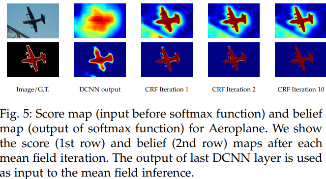
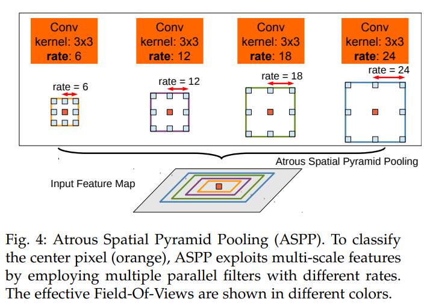
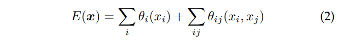
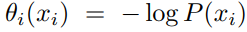
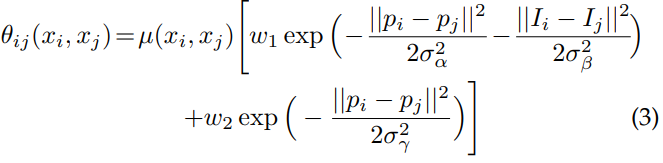
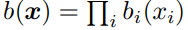

# DeepLab: Semantic Image Segmentation with Deep Convolutional Nets, Atrous Convolution, and Fully Connected CRFs

## Index

1. [Abstract](##Abstract)
2. [Related Work](##Related%20Work)
3. [Methods](##Methods)
4. [Experimental Results](##Experimental%20Results)
5. [Conclusion](##Conclusion)

## Abstract

- 2017년 논문
- [출처](https://arxiv.org/abs/1606.00915v2)
- Semantic Image segmentation에 관련된 논문
- 값어치가 있다고 실험적으로 증명된 3개의 공헌 : **atrous convolution**, **ASPP**, **DCNN + CRF**

  1. **atrous convolution**
      - upsample 된 filter에 convolution => dense prediction을 하는 데에서 강력한 도구로서 작동.
      - DCNN 안에서 feature response가 계산될 때 resolution(해상도)를 명확하게 제어할 수 있도록 만든다.
      - 파라미터의 개수나 computation 양을 증가시키는 것 없이 더 넓은 context을 합치기 위해서 filter들의 view 영역을 효과적으로 확장할 수 있게 만든다.
  
  2. **ASPP**
      - atrous spatial pyramid pooling (ASPP)
      - 다양한 스케일에서 물체를 엄격하게 분리하기 위해서 씀.
      - 효과적인 fields-of-views와 다양한 sampling rate에 있는 filter를 사용 convolutional feature layer를 살핀다.
      - 따라서 다양한 스케일에서 image context 뿐만 아니라 object도 잡음

  3. **DCNN + CRF method=> object boundary의 localization 향상**
      - 일반적으로 전개되는 max-pooling과 downsampling의 조합은 invariance를 향상, 그러나 localization accuracy에 영향을 끼침
      - 이를 마지막 DCNN layer의 responce를 fully connected Conditional Random Field (CRF)와 결합함으로서 극복
        - 이 결합은 질적, 양적 모든 측면에서 localization performance를 향상
  
- **Index Terms : Convolutional Neural Networks, Semantic Segmentation, Atrous Convolution, Conditional Random Fields.**

## Introduction

- DCNN의 성공 --> local image transformation에서 built-in invariance 때문.
  - 특히 classification에서 중요함. --> local image transformation이 추상적 데이터 표현을 배우도록 허락하기 때문.

- 그렇지만 semantic segmentation같이 dense prediction task(조밀한 예측 작업)에는 방해.
  - 공간 정보의 추상화가 필요 없기 때문.

- 이 논문에선 semantic image segmentation에 있어 DCNN의 3가지 문제점을 고려
  1. 감소된 feature resolution
  2. 다양한 스케일에서 object의 존재성
  3. DCNN invariance 때문에 localization accuracy가 감소

- 3가지 문제점의 극복

  - 감소된 feature resoltuion => Atrous convolution으로 극복

      
    - 원인
      - DCNN 안의 연속된 layer에서 실행되는 max-pooling과 downsampling('striding')의 반복적인 결합으로 인해 발생.
      - fully convolutional fashion에서 DCNN이 적용됬을 때 감소된 spatial resolution을 가진 feature map을 만들어 냄.
    - 해결
      - 마지막 부분에 존재하는, 몇 개의 max pooling layer 안의 downsampling operator를 제거, 대신 다음의 convolutional layer안에서 filter를 upsample
        => 더 높은 sampling rate를 가진 feature map을 산출한다.
      - Filter upsampling을 할 때 zero가 아닌 값들로 이루어진 filter tap들 사이에서 hole(trous)을 삽입한다.
        - 이 방법은 undecimated wavelet transform에서 효율적인 계산을 위해 고안된 방법이다.
        - 이를 atrous convolution으로 부르기로 한다.
      - 실제로, atrous convolution을 조합함으로서 full resolution feature map을 회복한다.
        - 이는 feature map을 더 조밀하게 만듬
      - atrous convolution은 기본 image size에서 feature response의 단순한 bilinear interpolation으로 이어진다.
      - dense prediction을 하는 데 있어, deconvolutional layer를 사용하는 것보다 단순하고, 강하다.
        - 큰 필터를 가지고 있는 정규 convolution과 비교하면, atrous convolution은 파라미터들의 개수나 computation의 양이 증가 하는 일 없이 filter의 시야를 효과적으로 증가시킬 수 있다.
  
  - 여러 스케일에서 object의 존재 => Atrous Spatial Pyramid Pooling (ASPP)로 해결
    - 원인
      - 여러 스케일에서 object가 존재하는 것 때문에 발생
    - 해결
      - 일반적인 방법 : 같은 이미지를 DCNN rescaled version으로 돌림 => 나오는 feature 또는 score map들을 모음.
        - 장점 : 이 시스템의 성능 증가
        - 단점 : 비용 (input image에 대해 DCNN layer들의 multiple scaled version에서의 response들을 계산해야 함)
      - Atrous spatial pyramid pooling (ASPP)
        - spatial pyramid pooling에 영향을 받아, convolution 전 주어진 feature layer를 resampling하는 계산적으로 효율적인 스키마를 제시함.
        - 이는 여러 개의 filter들로 이루어진 원본 이미지를 조사함.
          - 이 필터들은 각각 상호 보완적이고 효과적인 field-of-view를 가지고 있다.
        - 그래서 다양한 스케일에서 유용한 image context을 잡는 것만 아니라 object들도 잡는다.
        - 실제로 feature를 resampling하는 것 대신에, 다양한 parallel atrous convolutional layer에서 다른 sampling rate를 가지고 효과적으로 실행하는 것이 더 나았다.

  - DCNN invariance 때문에 localization accuracy 감소 => CRF로 해결
    - 원인
      - object를 중앙에 놓는 classifier는 기본적으로 DCNN의 spatial accuracy(공간 정확도)를 제한하면서 spatial transformation 안에서 불변성을 요구하는 것과 연관이 있다.
    - 해결
      - 한 가지 방법:
        - 마지막 segmentation 결과를 계산할 때 다양한 network로부터 "hyper-column" feature를 추출하기 위해서 skip-layer사용
      - 위 방법에 대한 대안 : CRF를 사용 (이 방법을 채택)
        - fully connected Conditional Random Field (CRF)를 적용시킴으로서 fine detail을 잡는 model의 능력을 향상시킴
          - CRF? class score들과 low-level information을 결합시키기 위한 목적으로 semantic segmentation에서 주로 사용
            - 이 때의 class socre는 multi-way classifier들로 얻어진다.
            - 이 때의 low-level information은 픽셀들과 edge들의 local interaction이나, superpixel들로 얻어진다.
        - 향상된 정교함의 작업이 계층적 또는 segment의 높은 순서 의존성을 모델링하기 위해 제안되었음에도 불구하고 fully connected pairwise CRF를 씀
          - 효과적인 계산을 위함.
          - 넓은 범위 의존성으로 전달하는 동안 알맞은 edge detail을 잡기 위함.
        - CRF는 pixel-level classifier에 기반한 성능 향상을 이끌어 냄. -> DCNN과 결합하면 최신의 결과를 얻을 수 있다.

  

- Image classification에서 쓰인 DCNN(이 논문에서는 VGG-16 이나 ResNet-101을 쓴다)을 Semantic Segmentation에 맞게 재구성(image classification -> semantic segmentation)
  - 방법
  1. fully connected layer를 convolutional layer로 변환 (즉, fully convolutional network)
  1. atrous convolutional layer를 통한 feature resolution의 향상
  - original network에서 32 pixel에 대한 연산을 적용시켰다면, 지금은 8 픽셀에 대한 응답을 계산할 수 있도록 했다.
  1. bi-linear interpolation 적용
  - original 이미지 해상도에 도달하기 위해서 score map을 8배 upsample 하기 위함
  - segmentation 결과들을 정제하는 fully-connected CRF의 input을 산출

- DeepLab 시스템의 3가지 장점
  1. Speed
      - atrous convolution의 장점으로 인해, DCNN은 NVidia Titan X GPU에서 8FPS로 운영된다.
      - fully-connected CRF를 위한 Mean Field Inference는 CPU에서 0.5초를 필요로 한다.
  2. Accuracy
      - PASCAL VOC 2012 semantic segmentation benchmark, PASCAL-Context, PASCAL-Person-Part, Cityscape에서 최신 결과를 얻음
  3. Simplicity
      - 잘 만들어진 모델 DCNNs과 CRFs의 cascade(계단식)로 구성되어 있다.

- 기타
  - 이 모델은 다중 스케일에서 object segmentation을 잘 한다.
    - 이는 multi-scale input processing 또는 proposed ASPP를 통해서 이루어진다.
  - 최신의 ResNet을 채택하여 DeepLab의 residual net을 구축.
    - VGG-16에 쓰인 original model과 비교했을 때 훨씬 나은 semantic segmentation 성능을 보여줬다.
  - 더 다양한 model variants들의 종합적인, 실험적인 평가를 제시함과 동시에 PASCAL VOC 2012 뿐만 아니라 다른 challenging에서도 좋은 결과를 냄
  - 이 모델은 Caffe framework로 실험해 봄.
  - [[코드]](http://liangchiehchen.com/projects/DeepLab.html)

## Related Work

- 대부분의 성공적인 semantic segmentation : flat classifier와 연관된 hand-crafted feature에 의존
  - 대표적인 예시 : Boosting[24], Random Forests[43], Support Vector Machines[44]
- context로부터 얻은 더 풍부한 정보와 구조적으로 만들어진 예측 기술들을 통합함으로서 많은 향상이 이루어짐.
- 이러한 성능은 특징들의 제한된 표현력에 의해 저하됨.
- 접근한 방식이 segmentation과 classification을 둘 다 포함하고 있기 때문에, **어떻게 두 가지 방법을 결합할 수 있는가**가 중요한 핵심이었다.
- Semantic segmentation을 목적으로 하고, DCNN을 베이스로 한 시스템
  - 계단식, bottom-up image segmentation
    - DCNN-based region classification에 영향을 받음.
    - ex) bounding box proposal, masked region들이 [R-CNN](/Semantic%20Segmentation/R-CNN.md)에서 사용되고, shape 정보를 classification process로 통합하기 위해 DCNN의 input으로 쓰인 것들이 여기에 포함.
    - 유사하게, [50]의 저자는 superpixel representation에 집중하고 있다.
    - 비록 이러한 접근이 좋은 segmentation에서 생겨난 sharp boundary들로 이점을 얻을 수는 있었겠지만, 그것을 사용함으로서 얻는 오점들을 회복할 수는 없었다.
  - Dense image labeling을 위해 DCNN feature들로 계산된 convolution-ally을 사용하는 것, 그리고 그것들을 독립적으로 얻어진 segmentation들과 연관시키는 것.
    - [39] 번은 첫 번째 경우를 시도했다.
      - 여러 image resolution에서 DCNN을 적용한 다음, 예측 결과를 부드럽게 하기 위해서 segmentation tree를 사용했다.
    - 최근까지, [21]번은 pixel classification을 위해 skip layer를 사용하는 것을 제안했고, DCNN안에서 계산된 중간 중간의 feature map들을 모으는 것을 제안했다.
    - 더욱이, [51]은 region proposal마다 중간의 feature map들을 pool하는 것을 제안했다.
    - 이러한 연구들은 DCNN classifier의 결과로부터 분해된 segmentation algorithm을 쓰고 있다. 따라서, 조급한 결정을 내렸을 위험성이 있다.
  - dense category-level pixel label을 직접적으로 제공하기 위해 DCNN을 쓴 경우.
    - 심지어 이 경우, segmentation을 전부 버리는 것이 가능하다.
    - [14], [52]같은 segmentation free 방식은 fully convolutional fashion에서 전체 이미지에 직접적으로 DCNN 을 적용한다.
      - 이는 DCNN에서 마지막으로 fully connected layer를 convolutional layer로 바꾼다.
      - [14]
        - introduction에서 outline된 spatial localization issue를 upsample하고 concatenate한다.
        - 그 동안, 또다른 DCNN으로 coarse result를 propagate하면서 예측 결과를 coarse한 것에서 fine한 것으로 만든다.
      - [22] 논문에서, multi-scal pooling 기술을 소개하고, densely connected CRF를 통합하면서, feature resolution을 조절하고 위의 작업을 확장시킨다.
      - 이러한 과정들이 object boundary들에 특히 도움이 될 것이라고 생각.
  - DCNN과 CRF의 combination
    - 기존의 연구는 locally connected CRF model에만 집중하고 있었다.
    - 특히, [53] 연구는 CRF를 DCNN을 기초로 한 reranking system의 proposal mechanism으로 쓰였다.
    - 반면에, [39] 연구는 local pairwise CRF를 위한 노드로서 superpixel들을 다뤘고, discrete inference를 위해 graph-cut을 사용했다.
    - 이러한 모델들은 superpixel computation에 있는 error들에 의해 제한되었고, long-range dependency들이 무시되었다.
    - **우리의 연구는 모든 pixel들을 DCNN에 의한 unary potential을 받는 CRF node로서 다룬다.**
      - [22] 연구는 fully connected CRF model에서 Gaussian CRF가 long-range dependency들을 잡아낼 수 있고, 같은 시간 동안 model이 fast mean field inference를 수정할 수 있다는 사실을 알려준다.
      - mean field inference : 전통적인 image segmentation에서는 많이 연구됬지만, 오래된 모델들은 short range connection만 가능했다.
      - [57] 은 매우 유사한 densely connected CRF model을 material classification의 문제를 해결하기 위해 DCNN의 결과를 정제하려고 사용했다.
      - [57] 의 DCNN 모델은, 하지만, 모든 픽셀에 대한 dense supervision이 아니라 sparse point supervision에 의해서만 훈련되었다.
  - [38] 논문에서 이미 첫 번째 버전이 공개 된 적이 있다.
    - Multiple group들은 [17], [40], [58], [59], [60], [61], [62], [63] 과 비교했을 때 PASCAL VOC 2012에서 bar를 크게 올렸다.
    - 이러한 방법들은 DeepLab 방식의 하나 혹은 두 개의 핵심 key 요소를 적용시켰다는 것이다.
      - 하나는 효율적인 dense feature extraction을 위한 Atrous Convolution
      - 또 하나는 fully connected CRF의 수단으로서 가공되지 않은 DCNN score의 정제
  - 중요한 발전
    - End-to-end training for structured prediction
      - 이 DeepLab에서는 post-processing method로 CRF를 적용시킨 반면, [40], [59], [62], [64], [65] 논문은 성공적으로 DCNN과 CRF의 joint leraning을 쫒았다.
      - 특히, [59], [65]는 전반적인 system을 end-to-end 훈련을 할 수 있는 feed-forward network로 바꾸기 위해서 CRF mean-field inference step들을 펼쳤다.
      - 반면에 [62] 논문은 학습할 수 있는 filter들을 가지고 convolutional layer들에 의해서 dense CRF mean field inference에서 하나의 iteration의 근사치를 냈다.
      - DCNN을 통해서 CRF의 pairwise term을 배우는 것
        - 더 많은 계산이 들어가지만, 성능은 매우 증가한다.
      - mean field inference에서 쓰였던 bilateral filtering module을 더 빠른 domain transform module [67]로 바꾸는 것
        - 이는 speed를 향상시키고 전반적인 시스템의 memory 요구량을 줄여준다.
      - [18], [68]은 semantic segmentation을 edge detection과 결합한다.
    - Weaker supervision
      - pixel-level semantic annotation이 전체 training set에서 가능하다는 주장을 꺾음
      - 이는 [72]와 같은 Weakly supervised pre-DCNN system보다 더 좋은 결과를 성취했기 때문이다.
      - 연구의 다른 라인에서는, [49], [73]이 instance segmentation을 따랐고, object detection과 semantic segmentation을 함께 다뤘다.
  - atrous convolution의 유래
    - undecimated wavelet transform의 효과적인 계산을 위해 개발되었다.
    - [15] 논문에서 "algorithme a trous"라는 말에서 왔다.
    - Atrous convolution은 또한 본질적으로 multi-rate signal processing 에서의 "noble identity"에서 왔다.
      - multi-rate signal processing : input signal과 filter sampling rate들의 동일한 interplay를 구축함 [75]
      - Atrous Convolution은 [6]에서 처음 사용되었다.
      - 이는 나중에 [76]에 의해 dilated convolution이라고 부른다.
        - 이는 operation이 upsampled (또는 dliated) filter의 regular convolution과 상호작용한다는 것에서 유래했다.
      - Atrous convolution은 [38]에서 유용하다고 생각했던 더 큰 context를 통합하기 위해서 filter의 시야를 확장시킨다.
      - 이러한 접근은 나중에 [76]에 의해 추적된다.
        - 이는 multiscale context를 통합하기 위해 increasing rate들을 가지고 atrous convolutional layer들의 series를 적용시켰다.
    - ASPP는 multiscale object를 잡기 위해 제안되었다.
      - 그리고 context는 또한 multiple atrous convolutional layer를 다른 sampling rate로 적용시켰다.
      - 이는 우리가, 하지만, atrous convolutional layer를 serial 방식이 아닌 parallel 방식으로 정렬하게 했다.
    - 이런 atrous convolution technique는 더 넓은 작업들에 적용된다.
      - object detection [12],[77]
      - instance-level segmentation [78]
      - visual question answering [79]
      - optical flow [80]
  - 또한, 더 진보된 image classification DCNN (예를 들어 [11]의 residual net)을 DeepLab에 적용시켜 더 나은 결과를 이끌었다. 이는 [81]에서 확인할 수 있다.

## Methods

### Atrous Convolution for Dense Feature Extraction and Field-of-View Enlargement

#### Atrous Convolution

- semantic segmentation, dense prediction task에 대해 DCNN을 fully convolutional fashion으로 배치해서 이용했다.
- 하지만, max-pooling과 striding을 연속적으로 다 거치는 것 = DCNN 안에서 각각의 direction을 통과할 때마다 feature map의 spatial resolution을 32배 감소시킴
- 부분적인 치료제 : deconvolutional layer [14]
  - 하지만 추가적인 메모리와 시간이 필요
- 따라서 deconvolutional layer를 쓰는 것보다 atrous convolution을 쓰는 게 낫다.
  - 이 알고리즘은 요구하는 resolution이 어떤 것이든, 어떤 layer의 응답이든지 계산하도록 한다.
  - 일단 한 번 훈련된 후에 적용된다. 하지만 겉보기엔 training과 통합되는 것처럼 보인다.
- 1차원 signal
  - 1차원 input *x[i]*, output *y[i]*, K length를 가진 filter *w[k]* 는 다음과 같이 정의된다.
  - .PNG)
  - rate parameter *r* : input signal을 sample한 stride에 상호연관된다.
  - Standard convolution에서는 r = 1을 가지는 special case이다.
  - 
- 2차원일 때 알고리즘의 작동을 묘사
  - 
  - atrous convolution이 없을 경우
    - 이미지가 주어지면, 처음에 resolution을 2배로 줄이는 downsampling operation을 한다.
    - kernel에서 vertical Gaussian derivative을 사용하여 convolution을 수행한다
    - 만약 하나가 원본 이미지와 같은 위치에 result로 나오는 feature map을 심으면, 이미지 position의 1/4만 response로 얻을 수 있다.
  - atrous convolution을 쓸 경우
    - 만약 full resolution image를 '구멍이 있는' filter(atrous filter)를 가지고 convolve 연산을 시키면 모든 이미지 position들에 대한 결과들을 계산할 수 있다.
    - 이 필터는 original filter의 2배를 upsample 하고, filter value들 사이에 있는 zero들을 소개한다.
  - 효과적인 filter의 size가 증가한다 하더라도, 우리는 non-zero filter value만을 설명할 필요가 있다.
    - 따라서, filter parameter의 수와 position당 operation들의 수는 constant하게 유지한다.
  - 결과로 나오는 scheme는 쉽고 명확하게 신경망 feature response의 spatial resolution을 control 하도록 도와준다.

#### Use for chain of layers

- DCNN에서의 context 안에서, atrous convolution을 layer들의 chain으로 사용할 수 있다.
  - 이는 자유롭게 높은 해상도에서 마지막 DCNN network의 response들을 계산하는 걸 허용한다.
  - VGG-16 또는 ResNet-101에서 계산된 feature response의 spatial density를 두 배로 하기 위해서 한 일
    - 마지막 pooling이나 convolutional layer의 stride를 1로 설정한다.
      - 이는 마지막 pooling('pool5')이나 마지막 convolutional layer('conv5_1')가 resolution을 감소시키기 때문이다.
      - 만약 stride를 1로 설정하면 signal decimation(신호의 sampling rate가 줄어드는 것)을 피할 수 있다.
    - 그리고 다음에 오는 모든 convolutional layer들을 rate가 2인 (r=2) atrous convolutional layer로 대체한다.
  - 이 방법은 original image의 해상도에 대해 feature response들을 계산할 수 있다.
  - 하지만 너무 cost가 많이 든다.
- 따라서 좋은 efficency/accuracy를 trade-off로 때리는 hybrid 방법을 적용했다.
  - **atrous convolution + fast bilinear interpolation**
  - 계산된 feature map의 density를 4배로 증가시키기 위해 **atrous convolution**을 사용
  - 이후 original image 해상도의 feature map을 회복하기 위해 추가적인 8배의 fast bilinear interpolation을 수행.
    - Bilinear interpolation은 이 정도 세팅으로도 class score map들이 (log-probability 로그-확률에서) 꽤 부드럽기 때문에 충분하다.
    - 이는 Fig 5로 증명된다.
    - 
  - deconvolutional approach와 다르게, 이 접근은 어떤 추가적인 parameter를 학습시키는 것 없이 image classification network를 dense feature extractors로 전환시킨다.
    - 이는 실제로 DCNN training을 빠르게 만든다.

#### Arbitrarily enlarge Field of view of filters at any DCNN layer

- 최신 DCNN은 일반적으로 공간적으로 작은 convolution kernel을 허용한다. (일반적으로 3x3)
  - 이는 파라미터의 수와 그 계산을 억제하기 위해서이다.
- rate r을 가지고 있는 atrous convolution은 연속적인 filter value에서 r-1개의 0들을 제안한다.
  - 효과적으로 kxk개의 filter kernel size를 키운다.
  - k = k + (k-1)(r-1)에 적용
  - 이 연산은 파라미터의 개수 증가나 계산량을 증가시킬 필요 없다.
- field-of-view를 제어하거나 accurate localization(small field of view)와 context assimilation[문맥 이해](large field of view)사이에서 가장 좋은 trade-off를 찾는 효율적인 mechanism을 제공한다.
  - VGG-16의 'fc6' layer에 r = 12인 atrous convolution을 적용시켰더니, 성공적으로 perfomance가 증가

#### Atrous convolution을 수행하는 2개의 효과적인 방법

1.**Implicitly upsample the filters by inserting holes (zeros)**

- 기초적인 feature map을 sparsely[듬성듬성] sample하는 option에 im2col이라는 function을 더해서 수행해봄
  - vectorized patch를 feature map의 다양한 채널에서 추출

2.**Equivalently sparsely sample the input feature maps**

- input feature map을 atrous convolution rate r과 동일한 요소로서 subsample하는 것.
  - r^2로 제거된 resolution map을 생산하기 위해서 이것을 deinterace한다.
  - 각각의 rxr possible shift를 위해 만들어진다.
- 위의 방법을 하기 전, 표준 convolution을 이러한 intermediate feature map에 적용시키는 것, 그것들이 original image resolution으로 reinterlace 하는 것이 먼저 진행된다.
- Atrous convolution을 regular convolution으로 줄임으로서, 기존의 optimized convolution routine을 사용하도록 허용한다.
- 이 논문에서 이는 Tensorflow framework에서 진행했다. [83]

### Multiscale Image Representations using Atrous Spatial Pyramid Pooling

- DCNN은 본질적으로 scale을 보여주는 주목할만한 능력을 보여줘왔다.
  - 다양한 사이즈의 object를 포함하는 dataset에서 단순히 훈련된 것만으로도 주목할만한 능력을 보여줌.
- 여전히 object scale에 대해 명시적으로 설명하는 것이 성공적으로 크고 작은 object들을 다루는 DCNN의 능력을 향상시킴.
- scale variability를 semantic segmentation에서 다루는 것에 대한 두 개의 접근 시도
  1. standard multiscale processing
      - 같은 parameter를 공유하는 parallel DCNN branch들을 사용하여 original image의 multiple rescaled version 에서 DCNN score map을 추출.
      - 마지막 결과를 생성하기 위해서, parallel DCNN branch들에서 original image resolution으로 feature map을 bilinearly interpolate 함.
      - 이 결과들을 종합해 각각의 position에서 가장 큰 response를 얻음으로서 합성시킴
      - Multiscale processing은 performance를 향상시켰지만, 모든 DCNN layer들에서 다양한 input의 크기를 고려하기 위한 feature response들을 계산하는 비용도 증가.
  2. convolutional feature -> resample
      - RCNN spatial pyramid pooling method의 성공에 영향을 받아 만들어짐. [R-CNN](/Semantic%20Segmentation/R-CNN.md)
        - 하나의 크기에서 추출된 convolutional feature들을 다시 sampling 함으로서 pyramid pooling method는 다양한 scale의 영역이 정확하게 효율적으로 classify됨을 보여줌.
      - 그래서 우리는 다른 sampling rate들을 가지고 Multiple parallel atrous convolutional layer들을 사용하는 scheme의 variant을 실행했다.
      - 각각의 sampling rate에서 추출된 특징들은 분리된 branch들에서 훨씬 잘 진행됬고, 최종 결과물을 생산하기 위해서 잘 융합했다.
      - 제시된 "atrous spatial pyramid pooling"(DeepLab-ASPP) 접근은 우리의 DeepLab-LargeFOV를 일반화합니다. 

### Structured Prediction with Fully-Connected Conditional Random Fields for Accurate Boundary Recovery

- localization accuracy와 classification performance 사이의 trade-off는 DCNN에서 본질적인 것으로 보인다.
  - Multiple max-pooling layer들을 가지고 있는 더 깊은 모델이 classification task에서 훨씬 성공적인 것으로 증명되었다.
  - 하지만, 증가된 invariance와 큰 top-level node의 receptive(수용적인) fields는 smooth response(부드러운 응답)만을 산출할 수 있다.
  - Fig 5에서 묘사되었듯이, DCNN score map은 object의 대략적인 위치나 존재를 예측할 수 있다. 하지만 그 경계선을 그리지는 못한다.
- 과거의 연구는 이러한 localization challenge를 설명하기 위해 2개의 방법을 따라갔다.
  - object의 경계선을 더 잘 추정하기 위해 convolutional network 안의 다양한 레이어에서 정보를 모으는 것
  - Low-level segmentation method에서 localization task를 대표하는 super-pixel representation을 적용하는 것.
- 이 연구에서는 DCNN의 인지 능력과 fully connected CRF에서 잘 얻어지는 localization accuracy를 결합을 기본으로 한다.
  - 이 결과는 localization challenge에서 주목할만한 성과를 거두었다.
    - 정확한 semantic segmentation 결과를 산출했다.
    - 현재의 방법으로 알아낼 수 없는 detail의 수준까지 object boundary들을 회복했다.
    - 이 방법은 [38]에서 첫 번째 버전을 밝힌 이후로 [17], [40], [58], [59], [60], [61], [62], [63], [65]으로 확장됬다.
- 전통적으로, CRF는 잡음이 많은 segmentation map들을 부드럽게 하는 데에 적용되었다.
  - 이러한 모델들은 spatially proximal pixel들에게 같은 label을 할당하는 것을 더 좋아하면서, 이웃하는 node들을 결합시킨다.
  - 이러한 짧은 범위의 CRF의 원시적인 기능은 local hand-engineered feature들의 맨 위에서 세워진 약한 classifier들의 거짓된 예측을 제거한다.
- 이런 약한 classifier와 비교해서, 현대 DCNN 구조는 질적으로 다른 score map과 semantic label prediction을 생성한다.
  - Fig.5에서 제시되었듯, score map은 꽤 부드럽고, 동등한 classification 결과를 생성한다.
  - 이러한 세팅에서, 짧은 범위의 CRF를 쓰는 것은 해로울 수 있다.
  - 이는 우리의 목표가 score map을 부드럽게 하는 것이 아닌, detail한 local structure을 회복하고 싶은 것이기 때문이다.
  - local-range CRF와 결합하는 데 있어 contrast에 민감한 가능성들은 localization을 잠재적으로 증가시키지만, 얇은 구조들을 놓치고 많은 비용이 들어가는 discrete optimization problem을 푸는 것을 필요로 한다.
- 짧은 범위의 CRF의 이러한 한계를 극복하기 위해서, Deeplab을 [22]에서 나온 fully connected CRF 모델과 통합시켰다.
  - 
  - **x : pixel들에 대한 label assignment**
  - 
  - P(xi) : DCNN에 의해 계산으로서 나오는 pixel i 에서의 label assignment probability
- fully-connected graph를 사용하는 동안, pairwise potential은 효율적인 추론을 허락하는 form을 가진다.
  - 예를 들어, 이미지 픽셀의 모든 pair를 연결할 때
  - 특히 [22]에서, 우리는 다음과 같은 표현을 사용한다.
  - 
  - xi != xj이고, 그렇지 않으면 0인 조건에서 u(xi,yi) = 1 이어야 한다.
  - 이는 distinct label들과 연결된 node들만이 불리해진다는 것을 의미한다.
  - 남은 표현들은 다른 feature space들에서 두 개의 Gaussian kernel들을 사용한다.
    - 첫 번째 : pixel position들(p라고 정의함)과 RGB color(I라고 정의함) 둘 다에 의존적인 'bilateral' kernel
      - 유사한 color나 position을 가지는 pixel들이 비슷한 label을 가지도록 만든다.
    - 두 번째 : pixel position들에게만 의존적인 kernel
      - smoothness를 강요 할 때 spatial proximity (공간 인접도)만 고려한다.
  - 시그마 알파, 시그마 베타, 시그마 감마 변수는 Gaussian kernel의 크기를 조절한다.
- 중요한 것은, 이 모델은 효율적인 확률론적 추론(probabilistic inference)의 근사치를 내기 위해서 수정될 수 있다.
  - Fully decomposable mean field approximation을 기초로 한 update를 통과한 message는 bilateral space에서 Gaussian convolution으로 표현될 수 있다.
    - Fully decomposable mean field approximation
    - 
  - High-demensional filtering algorithm은 실전에서 매우 빠른 알고리즘을 생성하면서 이런 계산의 스피드를 높였다.
    - [22] public하게 사용 가능한 실행을 하면서 Pascal VOC image들에서 평균보다 0.5초 덜 걸렸다.

## Experimental Results

## Conclusion

- DeepLab은 dense feature extraction을 하기 위해서 upsampled filter를 가진 'atrous convolution'을 적용함으로서 image classification에서 훈련되는 network를 semantic segmentation의 영역으로 재정의했다.
- 우리는 이것을 atrous spatial pyramid pooling으로 확장했다. 이는 multiple scale에서 image context 뿐만 아니라 object도 encode 시켰다.
- 의미론적으로 정확한 예측과 object boundary들에 따른 detailed segmentation map들을 생산하기 위해서 우리는 DCNN에서 나온 생각과 fully-connected CRF를 결합시켰다.
- 우리의 실험의 결과는 제시된 방법이 최근에 열린 다양한 대회의 dataset에서 꽤 진보했음을 보여준다.
  - PASCAL VOC 2012 semantic image segmentation benchmark, PASCAL-Context, PASCAL-Person-Part, 그리고 Cityscapes dataset들을 포함한다.

[코드 공유](http://liangchiehchen.com/projects/DeepLab.html)

배워야 할 keyword : spatial pyramid pooling, bi-linear interpolation, vertical Gaussian derivative, class score map, Gaussian kernel, Gaussian convolution

[21] B. Hariharan, P. Arbelaez, R. Girshick, and J. Malik, “Hyper- ´
columns for object segmentation and fine-grained localization,”
in CVPR, 2015.

[22] P. Krahenb ¨ uhl and V. Koltun, “Efficient inference in fully connected crfs with gaussian edge potentials,” in NIPS, 2011.

[24]J. Shotton, J. Winn, C. Rother, and A. Criminisi, “Textonboost for image understanding: Multi-class object recognition and segmentation by jointly modeling texture, layout, and context,” IJCV, 2009.

[39] C. Farabet, C. Couprie, L. Najman, and Y. LeCun, “Learning
hierarchical features for scene labeling,” PAMI, 2013.

[42]Z. Tu and X. Bai, “Auto-context and its application to highlevel vision tasks and 3d brain image segmentation,” IEEE Trans. Pattern Anal. Mach. Intell., vol. 32, no. 10, pp. 1744–1757, 2010.

[43]  J. Shotton, M. Johnson, and R. Cipolla, “Semantic texton forests for image categorization and segmentation,” in CVPR, 2008.

[51] J. Dai, K. He, and J. Sun, “Convolutional feature masking for joint
object and stuff segmentation,” arXiv:1412.1283, 2014.
